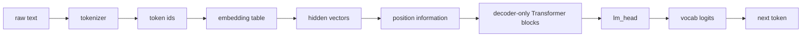
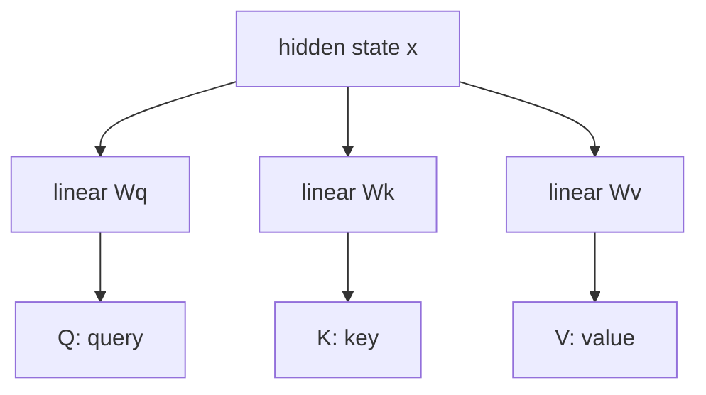
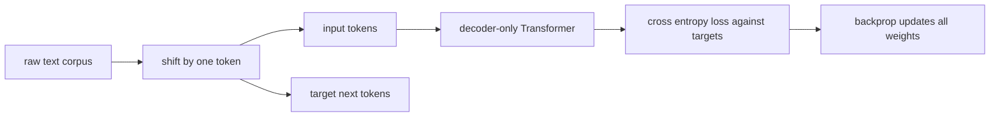
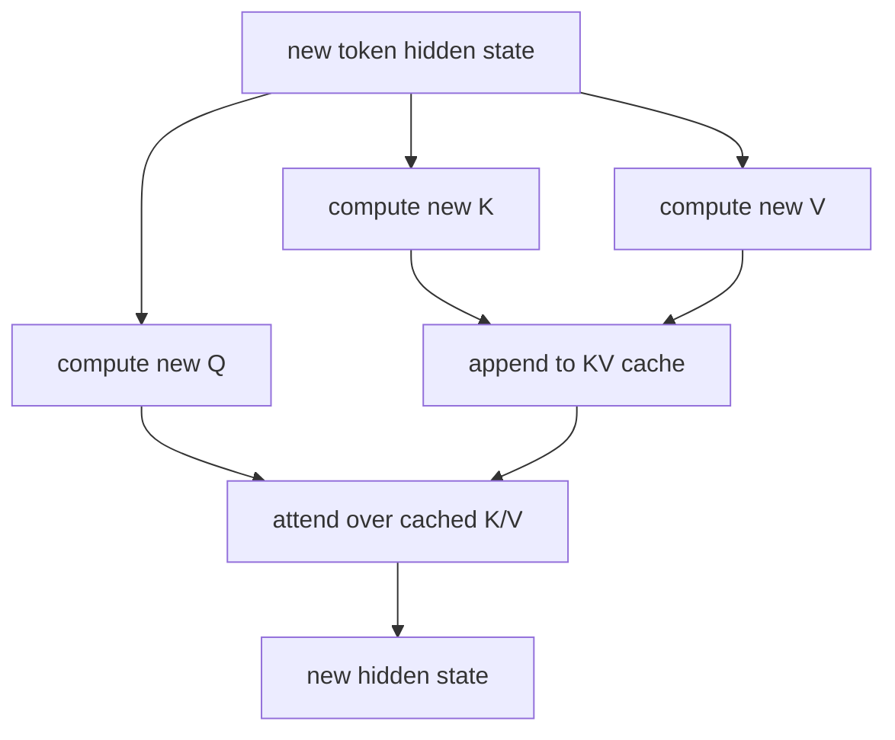

# GPT 原理图解：从 Token 到 Decoder-Only 自监督训练

这份文档整理几个最容易卡住的概念：

- tokenizer 到 embedding 的边界
- 隐藏维度、上下文长度、词表大小的区别
- Q/K/V 到底是不是复制三份
- attention 和词表计算分别发生在哪里
- KV cache 为什么只缓存 K/V
- decoder-only 架构为什么能把训练变成自监督任务

## 1. 一句话总览

GPT 是 decoder-only Transformer。它把文本切成 token id，把 token id 查表变成向量，再经过多层 masked self-attention 和 MLP，最后把 hidden vector 映射回整个词表的 logits，用来预测下一个 token。



最关键的分界：

```text
tokenizer: text -> token ids
embedding: token ids -> vectors
Transformer: vectors -> contextual vectors
lm_head: contextual vector -> vocab logits
```

## 2. Tokenizer 不是向量化

Tokenizer 只做离散映射：

```text
"我想吃苹果"
-> ["我", "想", "吃", "苹果"]
-> [103, 502, 918, 2044]
```

这些数字还不是向量。真正的向量来自 embedding table：

```text
token id 103 -> embedding_table[103] -> [0.12, -0.31, ...]
```

如果词表大小是 `vocab_size = 20000`，隐藏维度是 `n_embd = 768`：

```text
embedding_table shape = [20000, 768]
```

它的含义是：

```text
20000 个 token
每个 token 有一个 768 维向量
```

## 3. 三个容易混淆的尺寸

| 概念 | 常见名字 | 含义 | 例子 |
| --- | --- | --- | --- |
| 词表大小 | `vocab_size` | 模型认识多少个 token | 20000, 50257 |
| 上下文长度 | `block_size`, context length | 一次最多看多少个 token | 1024, 4096 |
| 隐藏维度 | `n_embd`, hidden dim | 每个 token 向量有多宽 | 768, 4096 |

假设：

```text
batch = 1
sequence length = 3
hidden dim = 768
vocab size = 20000
```

那么主要形状是：

```text
token ids:        [1, 3]
embeddings:       [1, 3, 768]
attention scores: [1, heads, 3, 3]
hidden states:    [1, 3, 768]
vocab logits:     [1, 3, 20000]
```

注意：

```text
attention 主要和 sequence length 有关
lm_head 才和 vocab size 有关
```

## 4. 位置编码加在哪里

GPT-2 风格是：

```text
x = token_embedding + position_embedding
```

二者形状一样：

```text
token_embedding:    [seq_len, hidden_dim]
position_embedding: [seq_len, hidden_dim]
x:                  [seq_len, hidden_dim]
```

RoPE 风格不同。RoPE 通常不是把 position embedding 直接加到 `x` 上，而是在 attention 里的 Q/K 上注入位置信息：

```text
x -> Q/K/V
Q/K -> apply RoPE
V   -> usually unchanged
```

## 5. Q/K/V 不是复制三份

Q/K/V 是同一个 hidden vector 经过三套不同参数矩阵得到的结果。

```text
Q = x @ Wq
K = x @ Wk
V = x @ Wv
```

其中：

```text
Wq, Wk, Wv 是三套可学习参数
不是把 x 简单复制成三份
```

可以这样理解：

| 向量 | 直觉含义 |
| --- | --- |
| Q, Query | 我现在想找什么信息 |
| K, Key | 我可以被别人怎样匹配 |
| V, Value | 如果别人关注我，我实际提供什么内容 |

同一个 token 的 hidden state 是 `x`，但它可以同时扮演三个角色：



实现时为了 GPU 效率，常常把三套矩阵拼成一次大线性变换：

```python
q, k, v = self.c_attn(x).split(c, dim=2)
```

这在数学上等价于同时计算：

```text
x @ Wq
x @ Wk
x @ Wv
```

## 6. Attention 不在词表里找词

这是非常重要的一点：

```text
attention 在上下文 token 之间计算关系
lm_head 才对整个词表打分
```

假设上下文是：

```text
我 想 吃
```

sequence length 是 3，那么 attention score 是：

```text
Q @ K.T -> [3, 3]
```

含义是：

| 当前 token | 可以关注谁 |
| --- | --- |
| 我 | 我 |
| 想 | 我, 想 |
| 吃 | 我, 想, 吃 |

GPT 使用 causal mask，所以不能看未来：

```text
第 1 个 token 不能看第 2, 3 个
第 2 个 token 不能看第 3 个
```

attention 公式：

```text
scores = Q @ K.T
weights = softmax(scores)
output = weights @ V
```

直觉：

```text
用 Q 和 K 算相关性
把相关性变成权重
用权重混合 V
```

## 7. 词表在哪里接回 Transformer

经过多层 Transformer 后，每个位置仍然是 hidden dim 宽度：

```text
hidden state h: [768]
```

最后通过 `lm_head` 映射到词表空间：

```text
logits = h @ W_vocab
```

如果：

```text
hidden dim = 768
vocab size = 20000
```

则：

```text
W_vocab: [768, 20000]
logits:  [20000]
```

这 20000 个数是每个 token 的分数：

```text
苹果: 8.2
香蕉: 6.7
汽车: -1.3
的: 4.9
...
```

然后：

```text
softmax(logits) -> probability distribution
sampling / argmax -> next token
```

如果使用 weight tying：

```text
lm_head.weight = embedding_table.weight
```

可以粗略理解为：

```text
最后的 hidden vector 和每个 token embedding 做点积打分
```

但它本质仍然是一个训练出来的 vocabulary classifier。

## 8. Decoder-Only 如何变成自监督训练

GPT 的训练目标是 next-token prediction。

原始文本：

```text
我 想 吃 苹果
```

自动构造成：

```text
输入: 我   想   吃
目标: 想   吃   苹果
```

也就是：

```text
看到「我」        -> 预测「想」
看到「我 想」     -> 预测「吃」
看到「我 想 吃」  -> 预测「苹果」
```

这个任务不需要人工标注，因为答案就在文本的下一个位置。



所以 GPT 的巧妙之处在于：

```text
生成任务本身提供了训练标签
```

## 9. 预测下一个词如何训练 Q/K/V

模型只直接监督最终答案：

```text
看到「我 想 吃」应该预测「苹果」
```

但 loss 会沿着计算图反向传播：

```text
loss
-> logits
-> final hidden state
-> MLP
-> attention output
-> attention weights
-> Q, K, V
-> Wq, Wk, Wv
```

如果模型应该关注「吃」却关注了别的 token，loss 会推动：

```text
Q(current) · K(吃)
```

变大一点，让类似上下文中「吃」更容易被关注。

同时，`V(吃)` 也会被训练成：

```text
如果别人关注我，我能提供对预测下一个 token 有帮助的信息
```

所以 Q/K/V 的语义不是人工写死的，而是为了降低 next-token loss 自己学出来的。

## 10. KV Cache 为什么缓存 K/V，不缓存 Q

推理时 GPT 一个 token 一个 token 生成：

```text
我 想 吃 -> 苹果
我 想 吃 苹果 -> ...
```

没有 KV cache 时，每一步都重复计算所有历史 token：

```text
step 1: K/V(我), K/V(想), K/V(吃)
step 2: K/V(我), K/V(想), K/V(吃), K/V(苹果)
```

前三个没变，却又算了一遍。

KV cache 的做法：

```text
cache: K/V(我), K/V(想), K/V(吃)
new:   K/V(苹果)
append new K/V to cache
```

为什么不缓存 Q？

因为未来 token 只需要用自己的 Q 去查询历史 K/V：

```text
Q(苹果) -> match cached K -> mix cached V
```

旧 token 的 Q 不再需要。旧 token 的 K/V 会被未来 token 查询，所以要缓存。



KV cache 加速的是：

```text
不用重复计算历史 token 的 K/V 和中间状态
```

它不能改变的是：

```text
生成仍然必须一个 token 一个 token 来
```

因为第 `t+1` 个 token 依赖第 `t` 个 token 的采样结果。

## 11. Encoder 不是没用，只是 GPT 主要不需要

三类 Transformer：

| 类型 | 代表 | 适合任务 |
| --- | --- | --- |
| Encoder-only | BERT | 分类、匹配、embedding、rerank |
| Decoder-only | GPT | 续写、对话、代码、agent |
| Encoder-decoder | T5, original Transformer | 翻译、摘要、输入转输出 |

GPT 选择 decoder-only，因为它天然适合自回归生成：

```text
past tokens -> next token
```

但 encoder 仍然很有用，尤其在检索、分类、语义表示、rerank 里。

## 12. 一个完整的形状例子

假设：

```text
batch = 1
seq_len = 4
hidden_dim = 8
vocab_size = 20
heads = 2
head_dim = 4
```

完整流程：

```text
token ids:
[1, 4]

embedding:
[1, 4, 8]

Q/K/V before heads:
[1, 4, 8]

Q/K/V after splitting heads:
[1, 2, 4, 4]

attention scores:
[1, 2, 4, 4]

attention output:
[1, 4, 8]

Transformer output:
[1, 4, 8]

lm_head logits:
[1, 4, 20]
```

最后一个位置的 logits：

```text
[20]
```

表示对 20 个词表 token 的预测分数。

## 13. 最小心智模型

如果只记一版，可以记这个：

```text
文本
-> tokenizer 得到 token ids
-> embedding 得到 hidden vectors
-> position information 告诉模型顺序
-> masked self-attention 在上下文 token 之间取信息
-> MLP 对每个 token 的表示做非线性加工
-> 多层堆叠得到更抽象的 hidden state
-> lm_head 对词表每个 token 打分
-> 预测下一个 token
```

以及：

```text
Q/K/V 不对应词表
Q/K/V 对应上下文 token 之间的信息路由
词表只在 embedding 输入和 lm_head 输出处出现
```

